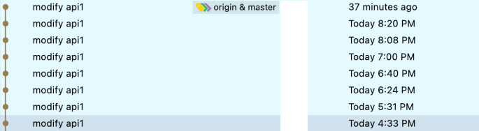
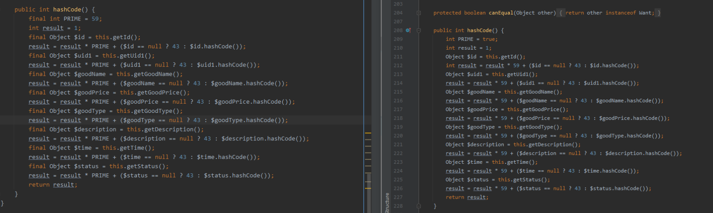
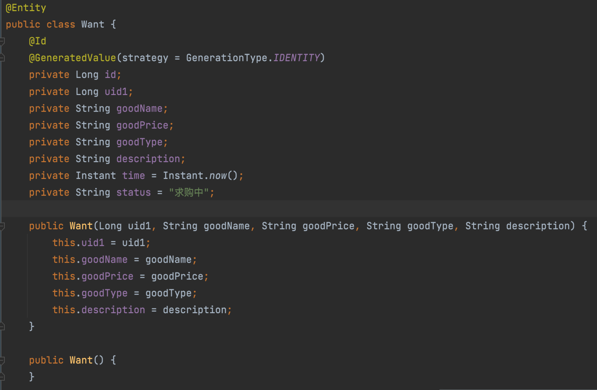
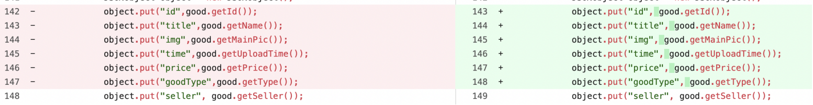
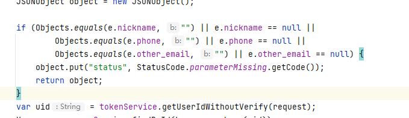

# SUSTech_perfect_code
南科大优质代码大赏

本仓库致力于发掘南科人优质代码，这些代码必须符合以下优点之一

```
1.队友终结者---能把队友干傻，拥有几乎没有的可读性
2.数据库绝杀---不挂外键，不正常构建数据库，数据库结构混乱
3.开源必杀人---使用开源代码，但是不加任何版权
4.代码行猎人---生成大量垃圾代码，从始至终并无使用，或可以使用更少代码的情况下就能解决的问题进行展开
5.Git猎马人---使用大量无意义Git commit或Git force push或各种令人崩溃的Git用法
```

如果您身边有相应的优质代码，也可以提交到本仓库，本仓库支持你所有常见的代码语言，前提是你在南科大见到且让你崩溃过一次的优质代码

本仓库禁止任何带有**明显**个人信息的内容出现，我们创建的初衷不是为了挂人而是为了帮助大家辨别代码情况和一些常见的代码错误，请您在提交pull request里面参考后面内容中的写法提交，否则我们将不予采纳。对于想匿名提交的同学可以私戳代码仓库作者，或发邮件与我联系（happys2333@outlook.com）

## 正文

#### 1. Git commit？那是什么



类别：Git猎马人、队友终结者

注：Git commit需要根据每次你做了什么进行更改，否则会拖慢进度

#### 2.反编译出来的代码也是我的代码



类别：代码行猎人、队友终结者

注：左侧是编写的代码，右侧是反编译库里的代码

#### 3.数据库为什么要外键



类别：数据库绝杀

注：这个表是需要和Good表进行链接的数据库，否则每次都需要通过id再查一遍，也就是应该通过外键与good进行链接

#### 4.新加空格也是一次commit



类别：Git猎马人

注：一次提交中仅仅多加了一个空格

#### 5.强类型代码难道不能写成弱类型吗？



类别：队友终结者

注：var是弱类型，类似auto在c++中，但是这里明显var是一个定死的类型，写成var只能让队友迷惑
